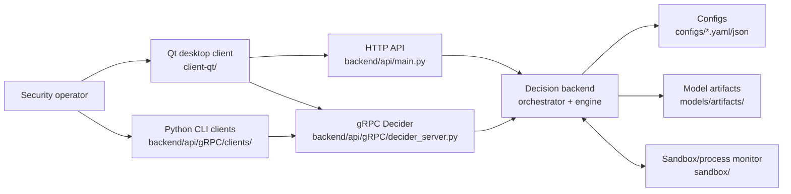
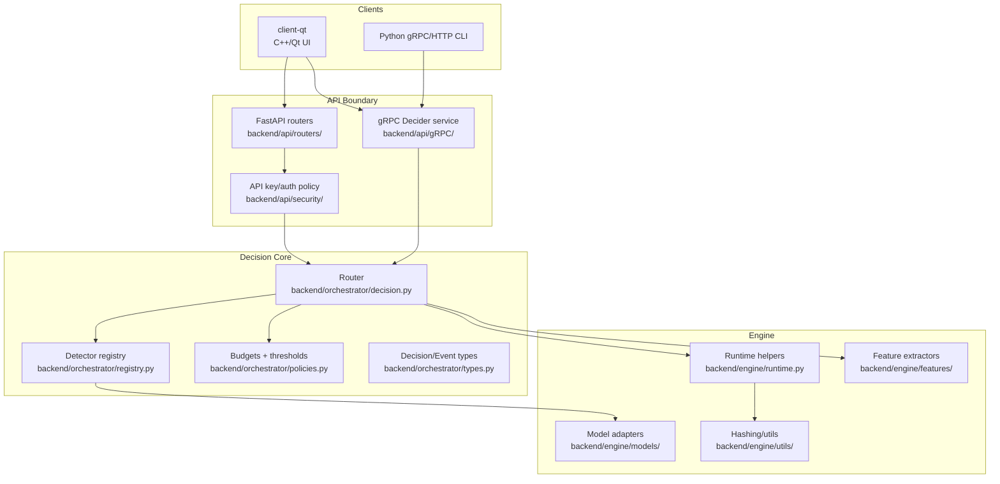
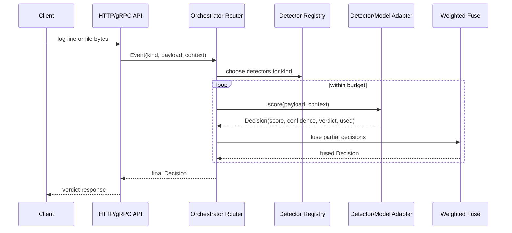
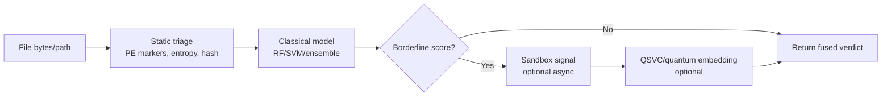
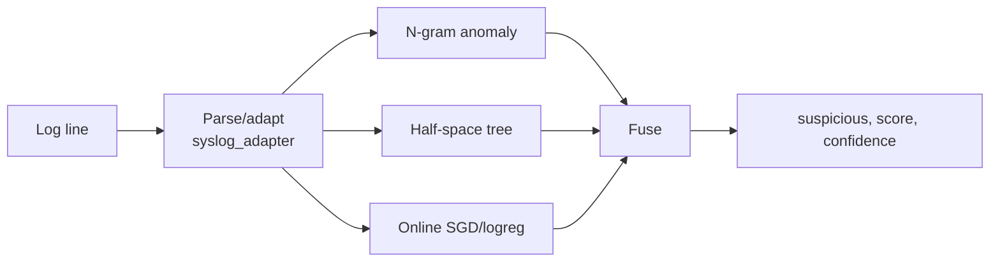
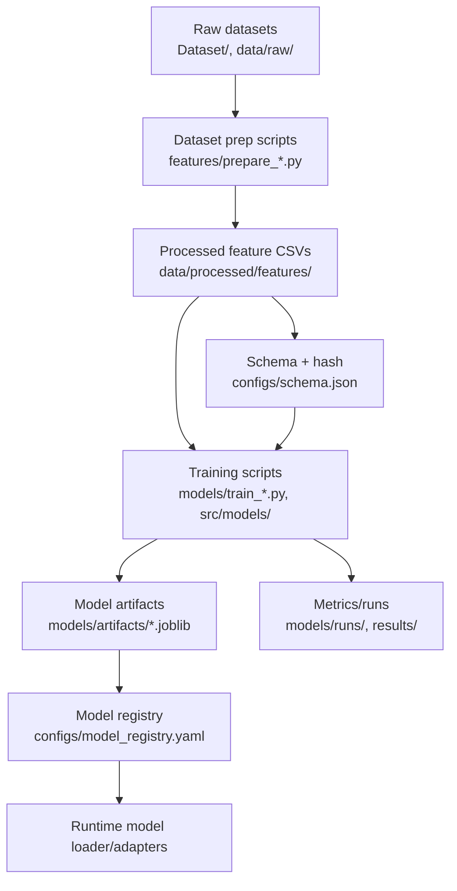
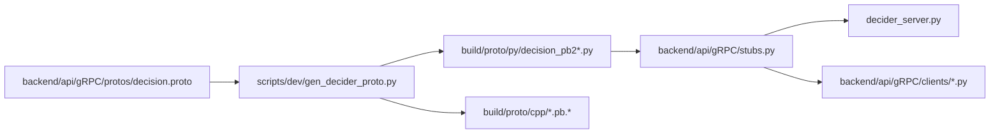
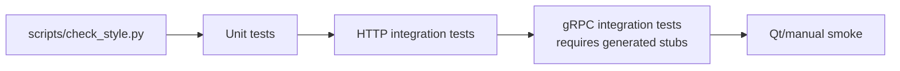

# Documents the target RAKSHAK software architecture.
# RAKSHAK Architecture Plan

RAKSHAK is a local-first malware/anomaly detection system. The target product is a desktop
operator console backed by a Python decision service that can score logs, files, and future
sandbox signals through a common orchestration layer.

This document is the architecture we should follow while cleaning the repo. When code and docs
disagree, update one of them rather than letting a second architecture quietly grow in a corner.

## Goals

- Provide one backend decision service for HTTP and gRPC clients.
- Keep model routing, feature extraction, policies, and model loading behind stable interfaces.
- Support fast log decisions, file triage, optional sandbox enrichment, and optional quantum/classical
  model stages.
- Keep training/research code separate from serving/runtime code.
- Make generated protobuf code reproducible and never hand-edited.
- Keep local development reliable on Windows and Linux.

## Non-Goals

- Do not make the Qt client own detection logic.
- Do not let `service/` become a second production backend.
- Do not commit generated caches, venvs, local temp folders, or large regenerated outputs.
- Do not require quantum dependencies for normal backend/unit test work.

## System Context



## Runtime Layers



## Core Runtime Flow

All runtime entry points should converge on `Router.decide(Event)`.



## File Decision Cascade

The file path should be cheap-first and expensive-last. Quantum or sandbox work only runs when
the earlier signal is borderline or policy explicitly asks for enrichment.



## Log Decision Flow



## Training And Artifact Flow

Training code can remain under `models/`, `src/models/`, and `features/` during migration, but
serving code must only load stable artifacts through backend model adapters.



## gRPC Contract And Codegen

The active decider contract is:

- Source: `backend/api/gRPC/protos/decision.proto`
- Generator: `scripts/dev/gen_decider_proto.py`
- Python output: `build/proto/py/`
- Runtime loader: `backend/api/gRPC/stubs.py`



Rule: generated files are build outputs. Do not edit them manually.

## API Surface

### HTTP

- `GET /health`
- `GET /v1/healthz`
- `POST /v1/scan/logline`
- `POST /v1/scan/file`

HTTP is best for simple local UI actions and health checks.

### gRPC

- `Decide`
- `StreamLogs`
- `UploadAndDecide`

gRPC is best for Qt integration, streaming logs, and large-file upload flows.

## Ownership Boundaries

| Area | Owns | Must Not Own |
| --- | --- | --- |
| `backend/api/` | Protocols, request validation, auth, response shape | Model internals |
| `backend/orchestrator/` | Detector ordering, budgets, thresholds, fusion | Feature extraction details |
| `backend/engine/features/` | Runtime-safe feature extraction | Training-only transforms |
| `backend/engine/models/` | Runtime model adapters and loading | Experiment orchestration |
| `models/`, `src/models/` | Training and experiments | Production request serving |
| `client-qt/` | Operator UX and backend calls | Detection decisions |
| `configs/` | Runtime config, schema, policy | Secrets or large artifacts |
| `scripts/dev/` | Codegen/dev utilities | Runtime business logic |

## Migration Plan

### Phase 1: Stabilize The Decision Path

- Keep `Router.decide(Event)` as the only runtime decision entry.
- Keep HTTP and gRPC routes thin.
- Make `backend/api/gRPC/stubs.py` the only generated-stub import helper.
- Add integration tests for HTTP log/file scan with auth.
- Generate bindings in CI before running the gRPC tests.

### Phase 2: Consolidate Legacy Service Code

- Decide whether `service/main.py` is deleted or kept as a compatibility wrapper.
- Move old `clients/python/*` onto `backend.api.gRPC.stubs` or mark them legacy.
- Keep legacy client paths as wrappers until downstream scripts migrate.

### Phase 3: Artifact Discipline

- Define artifact manifest format with model id, schema hash, training data id, metrics, and SHA-256.
- Ensure runtime model loading refuses artifacts with mismatched schema hash.
- Keep large data/results out of normal source diffs.
- Document exact commands for regenerating artifacts.

### Phase 4: Qt Integration

- Pick one primary Qt protocol path: gRPC for streaming/file upload, HTTP for health/simple actions.
- Generate C++ stubs from the active decider proto.
- Keep UI models as presentation models, not detection logic.
- Add a local mock backend mode for UI development.

### Phase 5: Sandbox Integration

- Replace `sandbox_stub.py` with a real adapter boundary.
- Make sandbox execution optional, budgeted, and cancellable.
- Treat sandbox output as another detector signal, not as a separate verdict system.

## Testing Strategy



Minimum local gate:

```powershell
.\.venv\Scripts\python.exe scripts\check_style.py
.\.venv\Scripts\python.exe -m pytest -q
```

gRPC gate after installing `grpcio-tools`:

```powershell
.\.venv\Scripts\python.exe scripts\dev\gen_decider_proto.py
.\.venv\Scripts\python.exe -m pytest -q tests\python\unit\orchestrator\test_grpc_stubs.py
.\.venv\Scripts\python.exe -m pytest -q tests\integration\api\test_decider_grpc.py
```

## Near-Term Cleanup Checklist

- [x] Generate decider stubs from `backend/api/gRPC/protos/decision.proto` in CI.
- [x] Remove stale root decider proto copies.
- [x] Update `docs/API.md` to include the active gRPC contract.
- [x] Move legacy Python clients to the active gRPC clients.
- [x] Add bounded HTTP tests for `/v1/scan/file`.
- [x] Package the backend with reproducible HTTP and gRPC entry points.
- [x] Add authenticated gRPC tests for unary, log streaming, and file streaming.
- [ ] Add model artifact manifest draft.
- [x] Replace sandbox stub with an adapter interface and fake implementation for tests.
- [x] Add CAPE external sandbox adapter placeholder with license-compliance docs.
- [ ] Implement CAPE submit/poll/report parsing behind `backend.engine.adapters.sandbox`.
- [ ] Add real C++ sandbox/process-monitor adapter only if CAPE does not cover a required local use case.
