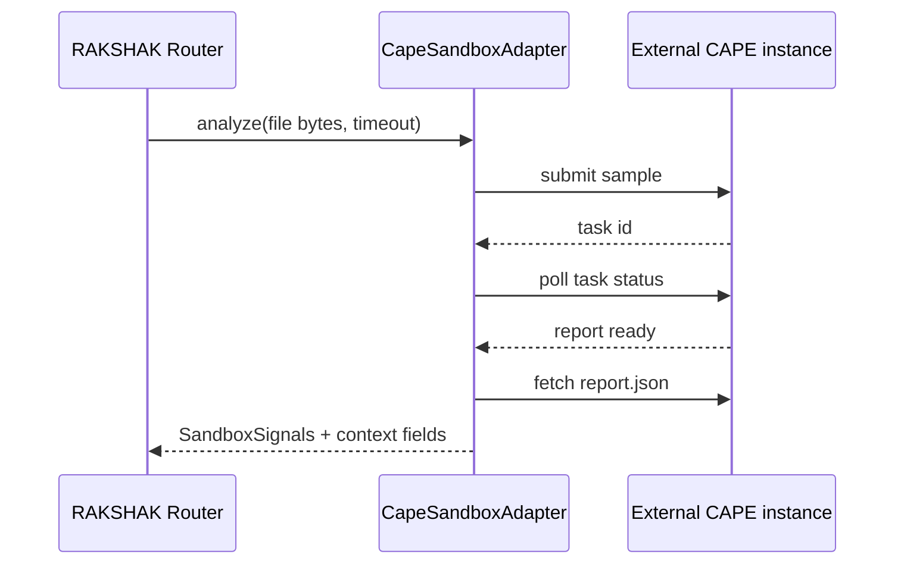

# Defines the external sandbox integration plan.
# Sandbox Integration Plan

RAKSHAK will integrate with CAPE Sandbox as an external dynamic-analysis provider. The sandbox is
a signal source, not the owner of the final verdict. The orchestrator still fuses sandbox output
with static, classical, and optional quantum model signals.

## Adapter Boundary

Runtime code must use:

```text
backend.engine.adapters.sandbox.create_sandbox_adapter()
```

Available adapters:

- `static`: default safe adapter; writes bytes to a temp file and emits metadata only.
- `cape`: external CAPE adapter placeholder; requires `RAKSHAK_CAPE_API_URL`.

## Why External CAPE

CAPE is a mature malware-analysis sandbox. It is also GPLv3-licensed, so the safest default
architecture is to run it as a separately installed service and keep RAKSHAK integration code in
our adapter layer. See `docs/THIRD_PARTY_NOTICES.md`.

## Environment Variables

```powershell
$env:RAKSHAK_SANDBOX_ADAPTER="cape"
$env:RAKSHAK_CAPE_API_URL="http://127.0.0.1:8000"
$env:RAKSHAK_CAPE_API_TOKEN="<optional-token>"
```

The `cape` adapter currently raises `NotImplementedError` until submit/poll/report parsing is
implemented.

## Target CAPE Flow



## Signal Mapping

The adapter should normalize CAPE report fields into `SandboxSignals` plus context keys:

- `sandbox_bytes`
- `sandbox_api_calls`
- `sandbox_signals`
- `sandbox_timed_out`
- `sandbox_backend`

Future context fields may include:

- `sandbox_processes`
- `sandbox_file_writes`
- `sandbox_registry_writes`
- `sandbox_network_indicators`
- `sandbox_yara_hits`
- `sandbox_dropped_files`
- `sandbox_mitre_tags`

## Safety Rules

- Never execute samples inside the RAKSHAK backend process.
- Never run CAPE as administrator/root unless CAPE deployment docs explicitly require and isolate it.
- Keep CAPE on an isolated analysis network.
- Treat sandbox output as untrusted input.
- Time-bound every sandbox request.
- Fail closed to "no sandbox signal" rather than blocking the main verdict path indefinitely.

## Implementation Steps

- [x] Add static sandbox adapter for local tests.
- [x] Add CAPE adapter placeholder and configuration checks.
- [ ] Add CAPE submit/poll/report client.
- [ ] Add report parser tests using sanitized fixture reports.
- [ ] Add timeout and cancellation tests.
- [ ] Add deployment docs for an external CAPE instance.
- [ ] Add third-party attribution to packaged builds if CAPE is bundled.
