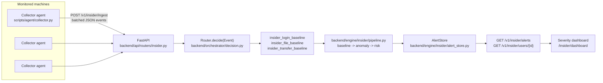

# Technical approach

## Architecture



One central node does all analysis. Agents on monitored machines hold no detection logic
and no per-employee state - they tail a local event log and forward batches. This directly
answers the PS's implicit architecture question: a fleet of employees is monitored *through*
one RAKSHAK instance, not with one instance per employee.

Both the ingestion path and RAKSHAK's original log/file scanning cascade converge on the
same `Router.decide(Event)` orchestrator - `ArtifactKind` grew four more values
(`insider_login`, `insider_file_access`, `insider_transfer`, `insider_hr_signal`) alongside
the existing `log`/`file` kinds, each routing to a single per-subtype detector instead of a
multi-detector cascade, since each event subtype has its own feature space.

## Event schema

Four JSON event shapes, one `event_type` field distinguishing them (`backend/api/schemas.py:InsiderEventIn`):

```json
{"employee_id": "EMP007", "event_type": "login", "timestamp": "2026-07-06T09:06:52Z",
 "host_id": "WKS-007", "src_ip": "10.20.7.101", "success": true, "method": "badge_sso"}

{"employee_id": "EMP007", "event_type": "file_access", "timestamp": "...",
 "host_id": "WKS-007", "path": "/shares/hr/employee_records.db",
 "sensitivity": "restricted", "action": "copy", "bytes": 505659}

{"employee_id": "EMP007", "event_type": "data_transfer", "timestamp": "...",
 "host_id": "WKS-007", "destination": "personal-gdrive", "channel": "usb", "bytes": 812000}

{"employee_id": "EMP007", "event_type": "hr_signal", "timestamp": "...",
 "signal_type": "resignation_submitted"}
```

`hr_signal` is deliberately not one of the three PS-listed types - see "Beyond the PS" below.

## Per-employee baseline and feature extraction

`backend/engine/insider/entity_state.py` keeps one `EmployeeBaseline` per `employee_id`:
an EWMA mean/variance (`RunningStat`, α=0.05) per tracked numeric quantity, plus
known-hosts/known-paths/known-destinations sets. A quantity isn't trusted for scoring until
it has ~20 observations (`WARMUP_MIN_OBSERVATIONS`) - before that, events are scored at
reduced weight rather than not at all, so a brand-new employee doesn't generate noise but
also isn't invisible.

`backend/engine/insider/features.py` turns a raw event into features relative to that
baseline, computed *before* updating it (score-then-update, so a point never influences its
own baseline comparison):

- **login**: hour-of-day z-score against this employee's own login-time distribution,
  whether the host has been seen before, off-hours flag (before 6am/after 8pm), failed-login
  flag.
- **file_access**: byte-volume z-score, kept **per sensitivity tier** rather than one
  blended baseline (mixing a routine small public doc with an occasional larger internal one
  otherwise inflates the baseline's own variance enough to make ordinary access look
  statistically surprising); new-path flag; off-hours flag.
- **data_transfer**: byte-volume z-score against the employee's own transfer sizes; a
  **trailing-7-day sum**, z-scored against their own historical weekly volume, specifically
  to catch staged/incremental exfiltration where no single transfer is large; new-destination
  flag; off-hours flag.

Login hour, file-access volume (per tier), and transfer weekly-sum each also maintain a
**slow-decaying sibling stat** (`SLOW_EWMA_ALPHA`, ~5x slower than the fast one) alongside the
normal fast baseline, feeding `hour_drift`/`volume_drift`/`transfer_drift` - see "Beyond the
PS: dual-timescale baseline" below.

File-access and data-transfer both also compute `blast_radius_bytes`, a trailing-14-day
sensitivity-weighted sum via `EmployeeBaseline.windowed_sum()` (a small generic trailing-window
helper, generalized from the pattern the 7-day staged-transfer sum already used) - purely
informational, not fed into risk scoring. See "Beyond the PS: blast-radius" below.

## Anomaly engine

`backend/engine/insider/anomaly.py` reuses `HalfSpaceForest` from
`backend/engine/models/classical/hst.py` directly - RAKSHAK's existing unsupervised, online,
no-training-required anomaly forest, already used for log-line scoring. One forest instance
per `(employee_id, event_subtype)`, deliberately small (10 trees, height 3) rather than the
log detector's sizing (30 trees, height 9): a per-employee forest sees a few hundred events
over a simulated month at most, and the larger tree size leaves each leaf under-visited
enough that novelty scores never settle - the smaller size actually converges at this sample
size. Feature values are squashed to roughly [0,1] before scoring, matching the same
input-scaling rule `log_features.py` documents for the log detector - unbounded z-scores fed
in raw destabilize the forest's per-feature threshold tracking.

**The raw score is not used directly.** `InsiderAnomalyEngine.score()` also maintains an EWMA
mean/variance of each employee/subtype's *own* recent raw scores and returns a self-relative
z-score alongside the raw one. HalfSpaceForest's raw score has a nonzero "floor" even for
regular behavior, and that floor turned out to vary enough by employee and feature mix that a
single fixed global threshold (tried first) let some employees false-trigger repeatedly - one
16-employee/42-day stress test put 2 of 12 normal employees at critical purely from this.
Comparing the raw score to that employee's own recent scores, the same pattern every other
signal in this engine already uses, fixed it without losing the true-positive catches.

## Risk scoring and the low-false-positive mechanism

`backend/engine/insider/risk.py` + `pipeline.py`. This is the part of the PS that's easy to
state and easy to get wrong in implementation, so the actual mechanism:

- A statistical flag (z-score ≥ 2.5σ, drift ratio ≥ 40%, or a genuinely new host/path/
  destination/off-hours/failed-login event) contributes a small, fixed, capped amount of
  risk - only when the threshold is actually crossed.
- The `HalfSpaceForest` anomaly signal is **threshold-gated the same way**, on its
  self-relative z-score (≥3.0σ, see "Anomaly engine" above), not continuously added in and
  not on a fixed raw-score cutoff. An earlier version weighted the raw score in continuously
  and every employee's risk converged to 1.0 within a single simulated day, regardless of
  actual behavior - a handful of events per day, each contributing even a small nonzero
  "floor" score, compounds past any threshold faster than a multi-day decay can counter it.
  Gating it to fire only on genuine outliers (like every other signal here) fixed this; it's
  the single most important correctness fix behind the "low false positive" claim actually
  holding up under testing.
- **Correlated sub-threshold signals get partial credit.** A feature past 60% of its own
  trigger but not fully over it earns nothing on its own - one elevated-but-not-triggering
  reading is unremarkable noise. But ≥2 of them elevated *in the same event* is a real,
  rarer-by-chance correlation (independently ~13% each, so several together is much less
  likely than any one alone) - this is what let a genuinely moderate insider pattern (several
  signals each just under threshold) still register instead of contributing nothing.
- Risk decays with a 3-day half-life (`RISK_DECAY_HALF_LIFE_S`). One anomalous event fades
  back out if nothing else follows it.
- Severity buckets (`low < 0.40 ≤ medium < 0.65 ≤ high < 0.85 ≤ critical`) mean `critical`
  in practice requires several distinct or repeated signals in a short window, not one event.
- Each subtype (login/file_access/data_transfer) tracks risk independently, since they score
  different feature spaces - the per-employee view exposed via the API takes the max across
  all three, so a real risk in one subtype can't be masked by a routine event in another
  (`blast_radius_bytes` is the one field that's summed across subtypes instead, since it's
  genuinely additive - see "Beyond the PS" below).
- The lifecycle multiplier (HR fusion) and per-reason feedback damping (analyst feedback
  loop) both apply here too - see "Beyond the PS" below for both.

Every alert carries the plain-language reasons that triggered it (e.g. `"trailing 7-day
transfer volume trending well above this employee's normal (2.1 sigma)"`), not just a score -
an operator (or a judge) can see why, not just how much.

## Beyond the PS

Five additions beyond what the PS literally asks for, each with a concrete mechanism, not
just a claim.

**Dual-timescale baseline.** `RunningStat` (`entity_state.py`) takes a configurable `alpha`;
login hour, file-access volume per tier, and transfer weekly-sum each maintain a
slow-decaying sibling (`SLOW_EWMA_ALPHA`) alongside the normal fast one.
`drift_zscore(fast, slow)` (login hour - a wandering, not trending, quantity) and
`drift_ratio(fast, slow)` (volume/transfer - genuinely climbing quantities, where a
variance-normalized z-score self-limits because the variance estimate grows right along with
the climb) both compare the two. This is what actually catches `slow_drift`: an insider whose
transfer volume compounds a few percent every weekday never crosses a single fast baseline's
own z-score threshold, because the fast baseline adapts right along with them.

**HR/lifecycle signal fusion.** `lifecycle_store.py`: a fourth event type
(`hr_signal`/`signal_type`) updates a time-boxed multiplier per employee
(`resignation_submitted`/`offboarding_scheduled` → 1.75x for 45 days,
`performance_improvement_plan` → 1.3x for 30 days, `role_change` → recorded, no effect).
`InsiderDetector.score()` applies it only when `contribution > 0` - a resignation with zero
anomalous behavior around it produces zero additional risk, proven in
`test_lifecycle_multiplier_alone_does_not_raise_risk` and the demo's dedicated control
employee (an HR signal with no injected scenario at all).

**Plain-language incident narrative.** `narrative.py`'s `build_narrative()` is pure template
composition over real data already computed: severity/risk/subtype lead sentence, deduped
`recent_signals` (surfaced via `RiskState.recent_signals`, which existed but was previously
never passed past `pipeline.py` - fixed as part of this), plus blast-radius/ETA when present.
No LLM call, no new dependency, consistent with RAKSHAK's local-first posture. Grounding is
enforced by construction: the function only ever formats strings it was handed, never
generates new claims.

**Analyst feedback loop.** `feedback_store.py`: `POST /v1/insider/alerts/{id}/feedback` with
`{"verdict": "confirmed"|"false_positive"}`. Threading this through required
`_reasons_and_contribution()` (`pipeline.py`) to return the raw feature *keys* behind each
reason, not just the formatted strings - `InsiderAlert.reason_keys` is what
`FeedbackStore.apply()` actually damps on. A dismissal halves that `(employee_id, reason_key)`
pair's future weight (floor 0.15, never fully silenced); a confirmation resets it to 1.0.
Still fundamentally unsupervised at cold start - no labels are needed to start scoring, this
is purely how it improves *after* an analyst has looked at something once.

**Blast-radius + time-to-critical.** `EmployeeBaseline.windowed_sum()` (`entity_state.py`) is
a small generic trailing-window helper, generalized from the pattern `staged_trend` already
used for its 7-day sum, reused here with a 14-day window for `blast_radius_bytes`
(sensitivity-weighted for file-access, raw for data-transfer, summed across subtypes at the
`AlertStore` aggregation layer since it's genuinely additive - unlike risk/severity, which
take the max). `eta_critical_days()` (`risk.py`) projects days-to-critical from an EWMA of
contribution-per-day, using **each event's own declared timestamp**, not wall-clock - a demo
backfills a month of history in seconds of real time, which would make a wall-clock rate
meaningless. Capped at a 365-day horizon: a near-zero rate is technically valid arithmetic for
a projection of millions of days, which is a real regression this exact feature hit in
testing and a useless number to show anyone, so it reports `null` instead past that horizon.

## API surface

- `POST /v1/insider/ingest` - batched events from collector agents (≤500/call), rate-limited
  per API key.
- `GET /v1/insider/alerts?min_severity=&employee_id=&limit=` - severity-sorted alert feed.
  Only `medium`+ severity events are stored as alerts (`ALERT_SEVERITY_FLOOR`); every event
  still updates the per-employee snapshot.
- `POST /v1/insider/alerts/{alert_id}/feedback` - `{"verdict": "confirmed"|"false_positive"}`,
  the analyst feedback loop (see "Beyond the PS" above).
- `GET /v1/insider/users/{employee_id}` - current risk/severity/reasons/narrative/
  blast-radius/ETA for one employee.
- `GET /insider/dashboard` - the severity dashboard (static page, not behind the API-key
  dependency; it prompts for the key client-side and sends it on each `/v1/insider/*` fetch).
  Includes confirm/dismiss buttons per alert (wired to the feedback endpoint) and each
  medium+ employee's narrative.

All JSON endpoints sit behind the same `x-api-key` auth (`backend/api/security/auth.py`) as
the rest of the backend.

## Collector agent

`scripts/agent/collector.py`: pure standard library (`urllib`, `json`), no dependency on the
`rakshak-backend` package or a Python virtualenv on the monitored machine. Tails a JSONL file
or directory of them, batches up to 50 events per POST. The read offset for a source file is
only persisted **after** its batches are confirmed sent (`_flush_all()` is all-or-nothing per
source) - an earlier version persisted the offset as soon as the file was read, before knowing
whether the send actually succeeded, so a rejected/failed batch (a rate limit, a transient
network blip) was silently treated as delivered on the next poll. All-or-nothing per source
means a failure re-reads and re-sends that source's whole unsent tail next cycle - a rare
duplicate delivery is a far smaller problem for an anomaly baseline than a silently dropped
event. The tail-then-POST design is identical on Windows and Linux - no OS-specific APIs are
involved. Real Windows Event Log (4624/4625) or NTFS USN journal collection is a documented
next step, not built for this pitch: the PS explicitly scopes to *simulated* organizational
logs, which is what's wired up end to end today.

## Simulated data

`samples/insider/generate_employee_logs.py`: N synthetic employees across four departments,
each with a stable normal profile (login-hour center, a small set of files they routinely
touch, a typical transfer destination/volume), emitting realistic-variance login/file-access/
data-transfer JSONL per employee over a configurable window (default 35 days - `slow_drift`
specifically needs the runway past its baseline's warm-up period to show a divergence). A
minority get one of four injected insider patterns (`resignation_exfil`, `staged_exfil`,
`odd_hours_new_host`, `slow_drift` - see `solution-overview.md`), plus `hr_signal` events
(a real `resignation_submitted` ~6 days before the `resignation_exfil` employee's file sweep,
and one control employee with an HR signal and zero anomalous behavior), so the pipeline has
real signal to catch and a real "does the multiplier alone false-trigger" check. Ground truth
is written to `manifest.json` for demo narration only - never fed to the detection pipeline.

## Engineering rigor

76 tests (unit + integration) cover the insider-threat engine end to end: baseline warm-up,
per-tier volume isolation, dual-timescale drift math, the self-relative anomaly z-score,
lifecycle multiplier gating, feedback damping and its floor, narrative grounding
(never invents a detail it wasn't handed), ETA/blast-radius math including the horizon-cap
regression test, and the ingest→alerts→feedback→per-user API flow end to end. The full repo
suite (277 passed, 4 skipped) passes unchanged alongside them. `scripts/check_style.py`,
`ruff`, and `bandit` are clean on every new/changed file, matching the same CI gate the rest
of the repo already runs (`.github/workflows/ci.yml`); `mypy` is likewise clean (one
pre-existing, unrelated `joblib` stub warning aside).

Two real bugs were caught by this testing discipline, not by inspection - both documented
where they were fixed (`anomaly.py`, `risk.py`, `entity_state.py`): a fixed anomaly-score
threshold that didn't generalize across employees, and an ETA projection that was
technically-correct-but-useless arithmetic (millions of days) on a near-flat rate. Both were
only visible by actually running the pipeline against generated data at a scale beyond the
first few validation runs, not by reading the code.

## What we deliberately didn't ship

- Real Windows Event Log / USN-journal collection (see Collector agent above).
- Baseline/risk-state persistence across a backend restart - currently in-memory only,
  same limitation the existing `log_hst`/`log_ngram` detectors would have without their
  periodic joblib checkpoint, which this engine doesn't have yet either.
- A `client-qt` view for these alerts - the web dashboard was the faster, lower-risk choice
  given the timeline; folding this into the existing Dashboard/Audit Logs pages is a
  reasonable next step.
- Correlation across employees (e.g. several people accessing the same sensitive resource in
  a short window) - every baseline here is strictly per-individual, which is what the PS
  asked for, but cross-employee patterns are a natural extension.
- A real HRIS connector - `hr_signal` ingestion and the multiplier logic are real and tested,
  but there's no connector to an actual HR system, only the same simulated-data generator
  used for everything else.
- Config-driven thresholds/weights - every constant in `pipeline.py`/`risk.py`/
  `lifecycle_store.py`/`feedback_store.py` is a module-level Python constant, not an
  ops-tunable config value. Fine for a demo, a real deployment would want this externalized.
