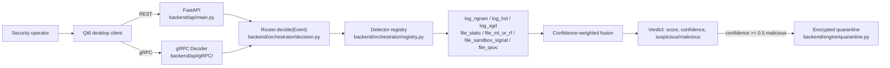
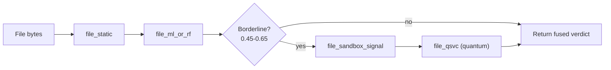

# Technical approach

## Architecture

Both HTTP and gRPC converge on the same `Router.decide(Event)` call — one decision core,
two protocols. The Qt client never implements detection logic itself; it's a console over
the real backend.

## Detectors, real measured numbers

| Detector | Type | Training data | Metrics (verbatim from `docs/results.md`) |
|---|---|---|---|
| `log_ngram` | Unsupervised, online | none (calibrates live) | sanity-tested manually, confirmed non-constant scores |
| `log_hst` | Unsupervised, online (half-space trees) | none (calibrates live) | same as above |
| `log_sgd` | Supervised, online logistic regression | LogHub HDFS_v1 | accuracy 0.9953, precision 0.2696, recall 0.6610, AUC 0.9823 (n_train 2755 balanced, n_test 80000 natural, 0.23% positive rate); block-level rollup 90.5% recall / 18.6% precision |
| `file_static` | Heuristic | none | entropy/header triage, always runs first, cheap |
| `file_ml_or_rf` | Supervised (LightGBM, in use) | EMBER2018 (80k train / 15k test, 2381-dim PE features) | accuracy 0.9491, precision 0.9390, recall 0.9616, AUC 0.9891 |
| `file_sandbox_signal` | Static enrichment | n/a | fed by a read-only, bwrap-isolated static pass — never executes the sample |
| `file_qsvc` | Hybrid classical+quantum SVM | EMBER2018 subset (2500 train / 800 test) | accuracy 0.6575, precision 0.6514, recall 0.7240, AUC 0.6911 — documented honestly as "modest," the weak link across every dataset this project has tried it on |

All numbers above are real, measured, and already documented in-repo — nothing here is
invented for the pitch.

## Fusion and the real-time cascade

Fusion is a confidence-weighted average: `score = Σ(score·confidence) / Σ(confidence)`,
verdict flips at `score >= 0.5`. The router short-circuits early once it's confident:

- fused score ≥ 0.75 with confidence ≥ 0.5 → **malicious**, stop.
- fused score ≤ 0.25 with confidence ≥ 0.5 → **benign**, stop.
- otherwise, score sits in a borderline band (0.45–0.65) and the cascade escalates —
  for files, that means running the sandbox signal and, last, the quantum SVM.

This is what makes the quantum stage real-time-compatible: it is a *tie-breaker*, not a
gate every file passes through. Latency budgets enforce this cheap-first design directly:
`LOG_MS=5` (p95 per log event), `FILE_INIT_MS=50` (initial file verdict),
`FILE_TOTAL_MS=250` (total, including sandbox enrichment).

## Sandbox isolation

`backend/engine/sandbox/` runs static analysis inside `bwrap` with
`--unshare-all --die-with-parent --new-session --clearenv`, read-only binds of
`/usr /lib /lib64 /etc` plus the interpreter prefix, a private per-run tmpfs, and a bound
scratch dir. `_bwrap_available()` does a *real functional probe* (not just a presence
check) because bwrap namespace creation is silently refused under default Docker seccomp —
if it can't actually sandbox, it falls back to rlimit-only isolation (256MB `RLIMIT_AS`,
5s `RLIMIT_CPU`) rather than silently running unconfined. A separate dynamic/traced
execution mode exists (`dynamic_runner.py`, bwrap+strace) but is opt-in only via
`RAKSHAK_SANDBOX_ADAPTER=dynamic` — the default posture never executes the sample.

## Quarantine

`backend/engine/quarantine.py`: Fernet symmetric encryption, key stored `chmod 0600`,
HMAC-SHA256 integrity check on the on-disk database, and a write-verify-then-delete-
original ordering so quarantining a file can never result in silent data loss.

## Client-backend wiring

The Qt client talks to the backend over `ApiClient`/`BackendClient`, with every request
carrying a `context` string so overlapping callers (manual scan vs. background tailing)
never cross-contaminate each other's results. A single `LogMonitor` instance backs
background tailing (an earlier double-instance bug caused every line to be scored twice —
fixed and verified: 3 real lines in → exactly 3 backend requests out). Two
`AlertsProxy` views sit over one shared `AlertsModel`: an unfiltered feed for the
Dashboard's Recent Activity, and a "Flagged"-only filtered view for the Log Analysis page.
Manual scan-file and check-line actions push into the same model as the background
tailer, so nothing an operator does by hand is invisible to the rest of the UI. Dashboard
counters (files scanned, lines checked, monitoring uptime) are real cumulative state, not
placeholder numbers.

## Deployment and ops

- Docker image runs as a non-root user; quarantine and online-learning checkpoint
  directories are redirected to a dedicated writable path.
- Dual protocol: HTTP (default `127.0.0.1:8080`) and gRPC (default `127.0.0.1:50055`),
  both loopback-bound by default, both requiring an `x-api-key` header/metadata (except
  `/health`, `/v1/healthz`).
- Per-key rate limiting (not raw IP, so NAT'd/proxied clients don't throttle each other):
  30/minute on `/v1/scan/file`, 300/minute on `/v1/scan/logline`, both configurable.
- Prometheus metrics exposed: request counts, latency histograms, verdict counts,
  quarantine counts.

## Engineering rigor

CI (`.github/workflows/ci.yml`) runs on every push: a custom style checker, `ruff`,
`mypy`, `bandit`, `pip-audit`, gRPC codegen, and `pytest` with a coverage floor —
216 tests passing, ~80% real coverage, plus a separate `gitleaks` secret-scan job and a
Docker build+health-check job. For a tool whose entire job is telling you what to trust,
its own supply chain and code quality have to hold up to the same scrutiny — this isn't
decoration, it's part of the pitch.

## What we deliberately didn't ship

- A ransomware-labeled classifier or dataset — the log-anomaly pipeline is the right
  primitive for this, but no ransomware-specific training has happened yet. Said plainly
  rather than hidden.
- A second, disconnected TLS/encrypted-traffic-analysis pipeline exists in the repo
  (`docs/overview.md`/`features.md`/`pipeline.md`/`models.md`) but was never wired to
  real data or to the live backend — deliberately shelved, not silently abandoned.
- CAPE sandbox integration (`docs/SANDBOX_INTEGRATION.md`) is a planned external adapter,
  currently a documented `NotImplementedError` stub — chosen as an external integration
  specifically because CAPE is GPLv3-licensed and shouldn't be vendored in.
